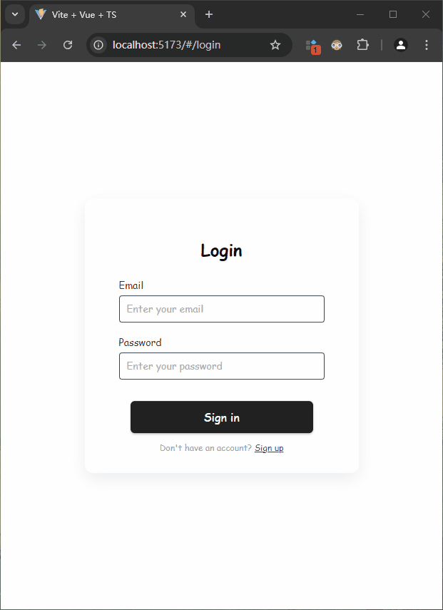

### 搭建基于 Vite + Vue3 + TS 项目模板


该项目是一个基于 Vite + Vue3 + TS 的项目模板，目的是为了节省每次开发新项目用于配置环境的时间，并附有简单的登录、注册及导航页。

**项目集成：**

- [Vite](https://cn.vitejs.dev/guide/)
- [Vue3](https://cn.vuejs.org/guide/introduction)
- [Typescript](https://www.tslang.cn/docs/handbook/typescript-in-5-minutes.html)
- [Vue-router](https://router.vuejs.org/zh/guide/)
- [Pinia](https://pinia.web3doc.top/introduction.html)
- [Pinia-plugin-persistedstate](https://prazdevs.github.io/pinia-plugin-persistedstate/zh/guide/)
- [Element-plus](https://element-plus.org/zh-CN/component/overview.html)
- [Axios](https://www.axios-http.cn/docs/intro)
- [VueUse](https://vueuse.nodejs.cn/functions.html)
- [Less](https://less.bootcss.com/#%E6%A6%82%E8%A7%88)

**项目启动**

项目地址：

- github：<https://github.com/ljh-coder/vite-vue3-ts-template>
- gitee: <https://gitee.com/ljh210107/vite-vue3-ts-template>

拉取项目并安装相关依赖包（此处以 `gitee` 为例）：

```shell
git clone https://gitee.com/ljh210107/vite-vue3-ts-template.git
cd vite-vue3-ts-template
yarn install
```

启动项目（登录、注册功能需要自行搭建后端配合使用）：
```shell
yarn run dev
```

**项目演示**

内附简单的登录、注册及导航页，需要自行搭建后端配合使用：



项目搭建详情参见博客：<https://blog.csdn.net/qq_45897239/article/details/141278865>